# 第 2 周

## 测试报告

### 部署环境的机器配置

在 AWS Lightsail 上租用虚拟机：

| 节点名称 | 部署服务                    | CPU     | 内存 | 磁盘规格型号 |
| -------- | --------------------------- | ------- | ---- | ------------ |
| PD1      | TiDB/PD                     | 4 vCPUs | 16G  | 320GB SSD    |
| KV1      | TiKV                        | 8 vCPUs | 32G  | 640GB SSD    |
| KV2      | TiKV                        | 8 vCPUs | 32G  | 640GB SSD    |
| KV3      | TiKV                        | 8 vCPUs | 32G  | 640GB SSD    |
| Client   | 无服务 (用于作为测试客户端) | 4 vCPUs | 16G  | 320GB SSD    |

由于使用了 3 个节点分别部署 TiKV，因此不需要调整 TiKV 线程池配置。

#### Tiup 部署

部署完毕后，执行：

```sh
$ tiup cluster display tidb-test
```

得到下图内容：

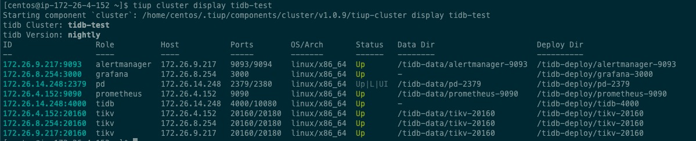

利用 mysql client 连接 TiDB 并创建示例数据库：

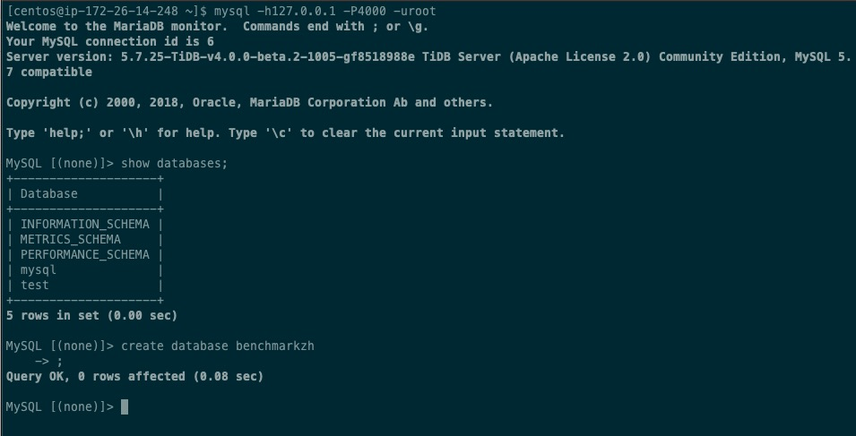

访问 Dashboard：

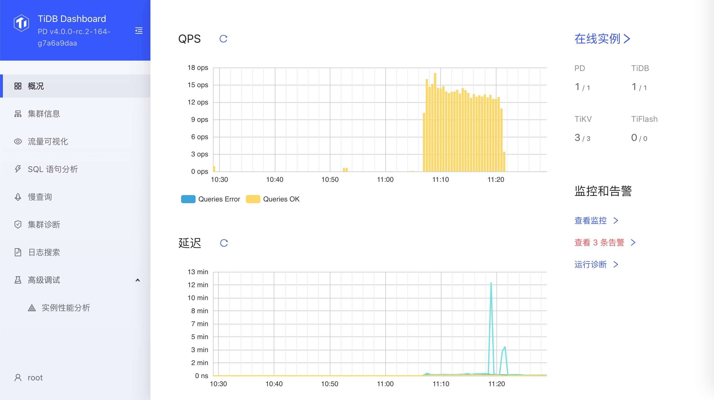

访问 Grafana：

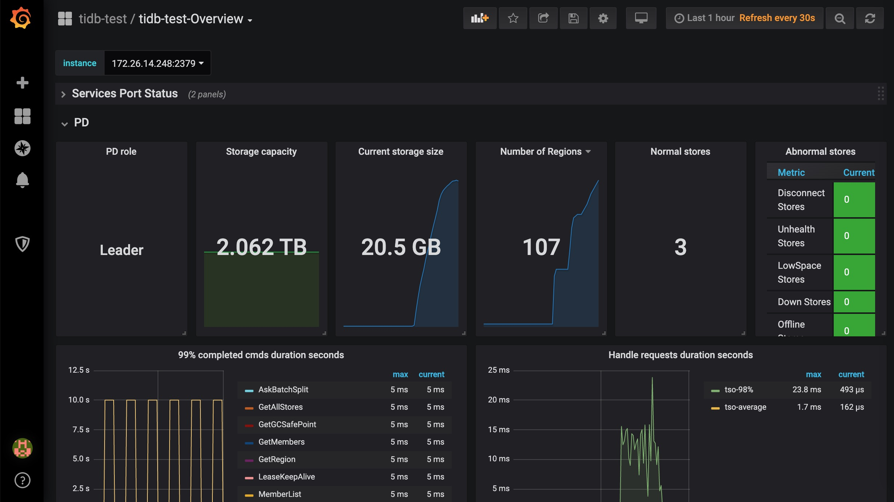

### sysbench

在 Client 机器上安装 sysbench：

```sh
$ curl -s https://packagecloud.io/install/repositories/akopytov/sysbench/script.rpm.sh | sudo bash
$ sudo yum -y install sysbench
```

安装 mysql client：

```sh
$ sudo yum install mysql
```

编辑 config：

```
mysql-host=172.26.14.248
mysql-port=4000
mysql-user=root
mysql-db=sbtest
report-interval=10
```

准备数据：

```sh
$ sysbench oltp_update_non_index --config-file=config --threads=32 --tables=32 --table_size=1000000 prepare
```

发现 TiDB 的时延立马上去：

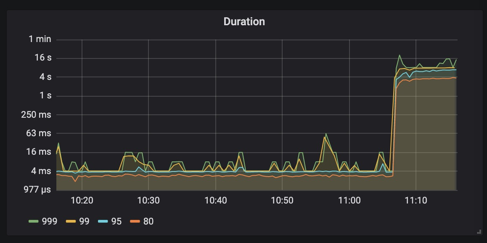

在插入数据的时候抓一个 [profile](./2/profiling_1_1_tidb_172_26_14_248_4000487838176.svg)，发现花费时间较多的模块是 parser (yyParse)、table (CastValue) 以及 tables (AddRecord)，前者顾名思义应该是解析 SQL 的模块，后者是在执行插入语句的时候做数据类型转换和执行模块；在插入索引的时候抓一个 [profile](./2/profiling_2_2_tidb_172_26_14_248_4000727712329.svg)，发现花费时间较多的是 ddl (backfillIndexInTxn)，以及 runtime 中的 mallocgc 和 scanobject，999 线在 10s 左右。暂时忽略这个问题。

另外再准备一个小一些的数据集，作为对比：

```sh
$ sysbench oltp_update_non_index --config-file=config-small --threads=32 --tables=8 --table_size=100000 prepare
```

#### oltp_point_select

先预先用 16, 32, 64, 128, 256, 512 线程数跑一次，大致可以看出，随着线程数的增加，95 分位在增加，tps 也在增加，但 tps 的增加率 (二阶导) 在减少，符合预期，经过权衡，取 `--threads = 128`：

```sh
$ sysbench --config-file=config oltp_point_select --threads=128 --tables=32 --table-size=1000000 --time=100 run
$ sysbench --config-file=config-small oltp_point_select --threads=128 --tables=8 --table-size=100000 --time=100 run
```

在大数据集上的运行报告如下图所示：

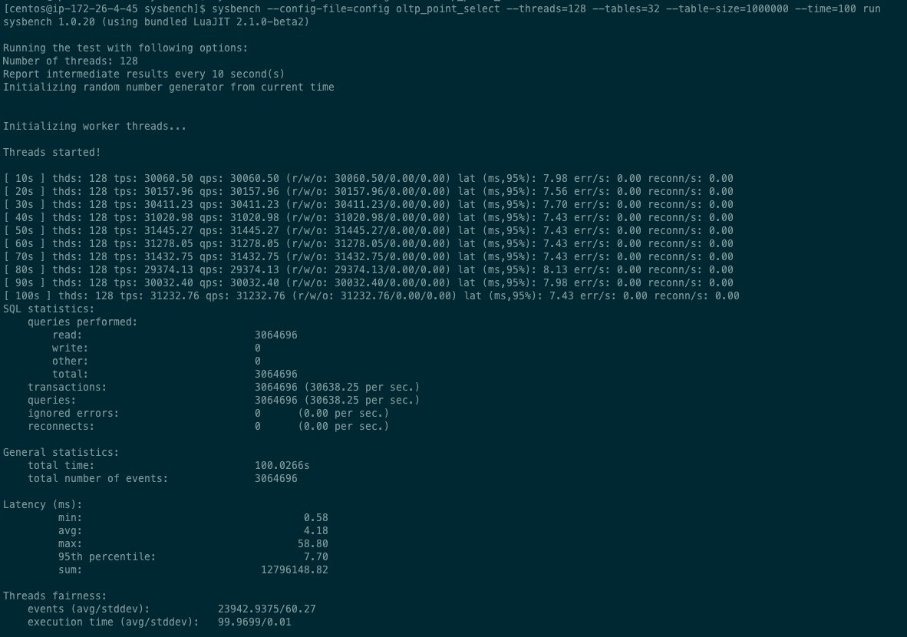

tps/qps 在 3.1W 左右，时延的 95 分位在 7.7ms，时延最大值为 58ms。

在小数据集上的运行报告如下图所示：

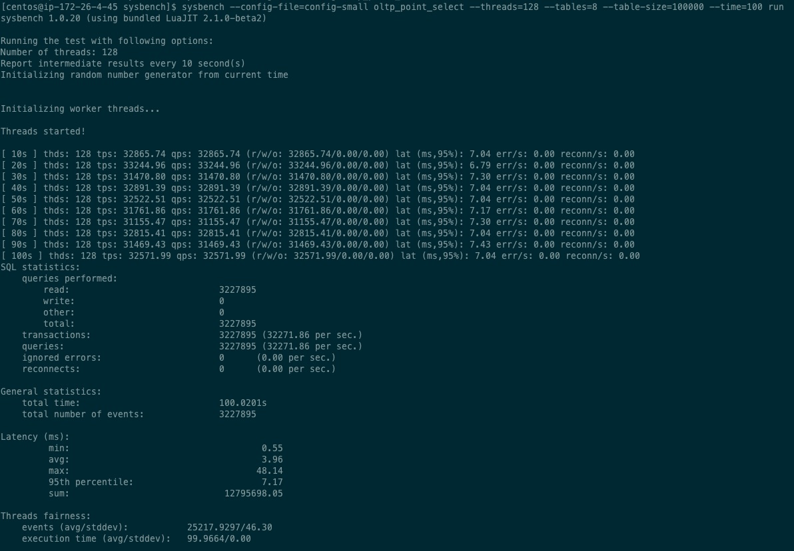

基本上指标比大数据集表现稍好一点，但不明显，符合预期。

追了一下[源码](https://github.com/akopytov/sysbench/blob/master/src/lua/oltp_common.lua)，`oltp_point_select` 用的是主键：

```lua
point_selects = {"SELECT c FROM sbtest%u WHERE id=?", t.INT}
```

#### oltp_update_index

先预先用 16, 32, 64, 128, 256, 512 线程数跑一次，规律和 `oltp_point_select` 的一样，线程数取 128 或 256 都还不错，这里继续取 `threads=128`：

```sh
$ sysbench --config-file=config oltp_update_index --threads=128 --tables=32 --table-size=1000000 --time=100 run
$ sysbench --config-file=config-small oltp_update_index --threads=128 --tables=8 --table-size=1000000 --time=100 run
```

在大数据集上的运行报告如下图所示：


tps/qps 在 5.5K 左右，95 时延分位在 40ms，时延最大值为 3.1s。

在小数据集上的运行报告如下图所示：

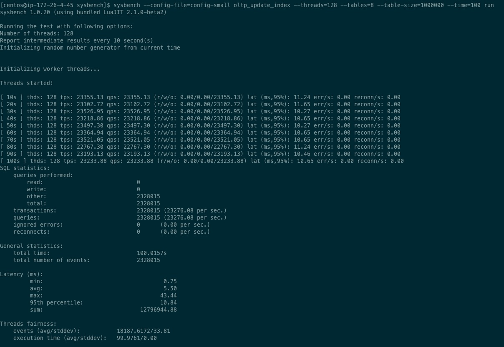

索引更新在小数据集上的表现明显更好，tps/qps 在 2.3W 左右，95 时延分位在 10ms，时延最大值为 43ms。原因暂不追查，盲猜是因为数据量大导致索引和数据的局部性不够理想。

另外 `oltp_update_index` 走的是普通索引 (二级索引，且非唯一索引)：

```lua
index_updates = {"UPDATE sbtest%u SET k=k+1 WHERE id=?", t.INT}
```

#### read-only

read-only 在一个事务内运行五种只读查询：point_selects (10次)、simple_ranges、sum_ranges、order_ranges 和 distinct_ranges，具体如下：

```lua
local stmt_defs = {
   point_selects = {"SELECT c FROM sbtest%u WHERE id=?", t.INT},
   simple_ranges = {"SELECT c FROM sbtest%u WHERE id BETWEEN ? AND ?", t.INT, t.INT},
   sum_ranges = {"SELECT SUM(k) FROM sbtest%u WHERE id BETWEEN ? AND ?", t.INT, t.INT},
   order_ranges = {"SELECT c FROM sbtest%u WHERE id BETWEEN ? AND ? ORDER BY c", t.INT, t.INT},
   distinct_ranges = {"SELECT DISTINCT c FROM sbtest%u WHERE id BETWEEN ? AND ? ORDER BY c",
t.INT, t.INT},
}
```

其中 range_size 默认取值为 100。

先预先用 16, 32, 64, 128, 256, 512 线程数跑一次，线程数在 32 左右 tps 与时延之间的 trade-off 比较理想，因此设置 `--threads=32`：

```sh
$ sysbench --config-file=config oltp_read_only --threads=32 --tables=32 --table-size=1000000 --time=100 run
$ sysbench --config-file=config oltp_read_only --threads=32 --tables=8 --table-size=100000 --time=100 run
```

在大数据集上的运行报告如下图所示：

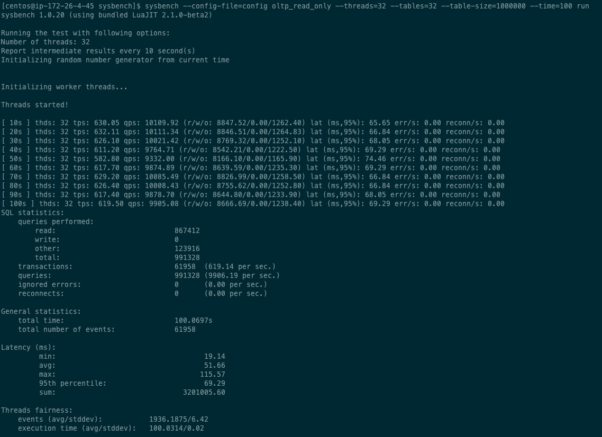

tps 620，qps 1W，95 时延分位 70ms。

在小数据集上的运行报告如下图所示：

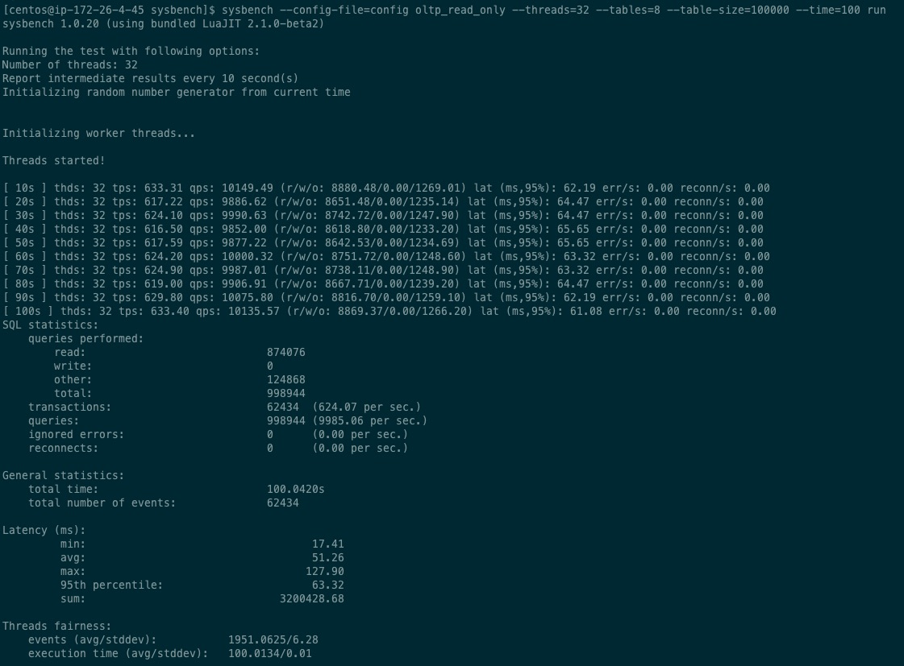

指标基本持平。这里都是按照 id 进行范围查询，效率持平可以理解。

### go-ycsb

#### workloada

```sh
# 大数据集
# 载入数据
$ ./bin/go-ycsb load mysql -P workloads/workloada -p recordcount=1000000 -p mysql.host=172.26.14.248 -p mysql.port=4000 --threads 256
# 运行 workload
$ ./bin/go-ycsb run mysql -P workloads/workloada -p recordcount=1000000 -p mysql.host=172.26.14.248 -p mysql.port=4000 --threads 64

# 小数据集
$ ./bin/go-ycsb load mysql -P workloads/workloada -p recordcount=100000 -p mysql.host=172.26.14.248 -p mysql.port=4000 --threads 256
$ ./bin/go-ycsb run mysql -P workloads/workloada -p recordcount=100000 -p mysql.host=172.26.14.248 -p mysql.port=4000 --threads 64
```

经过试错发现 threads 取 64 在时延和 ops 间能取得较好的均衡。

大数据集统计数据如下：

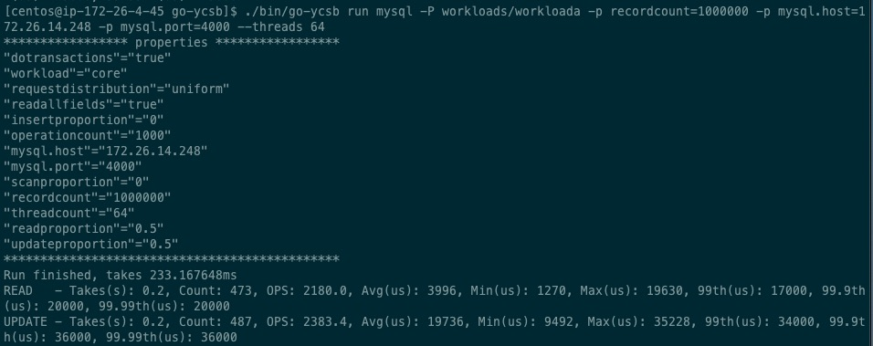

小数据集统计数据如下：

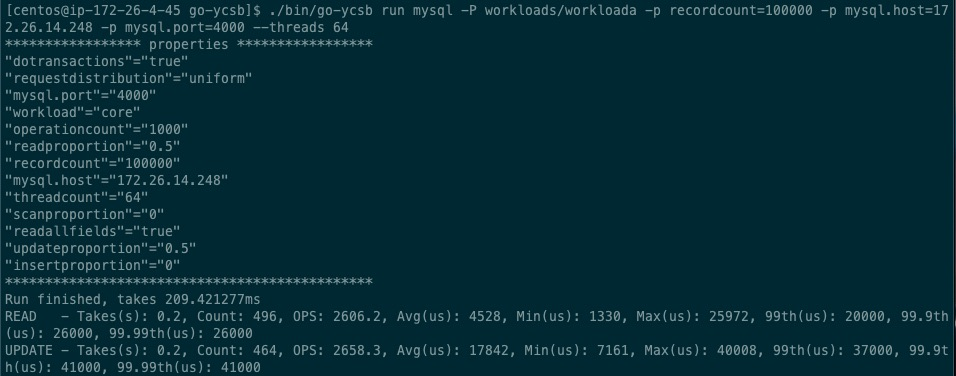

#### workloadb

```sh
# 大数据集
# 载入数据
$ ./bin/go-ycsb load mysql -P workloads/workloadb -p recordcount=1000000 -p mysql.host=172.26.14.248 -p mysql.port=4000 --threads 256
# 运行 workload
$ ./bin/go-ycsb run mysql -P workloads/workloadb -p recordcount=1000000 -p mysql.host=172.26.14.248 -p mysql.port=4000 --threads 64

# 小数据集
$ ./bin/go-ycsb load mysql -P workloads/workloadb -p recordcount=100000 -p mysql.host=172.26.14.248 -p mysql.port=4000 --threads 256
$ ./bin/go-ycsb run mysql -P workloads/workloadb -p recordcount=100000 -p mysql.host=172.26.14.248 -p mysql.port=4000 --threads 64
```

经过试错发现 threads 取 64 在时延和 ops 间能取得较好的均衡。

大数据集统计数据如下：

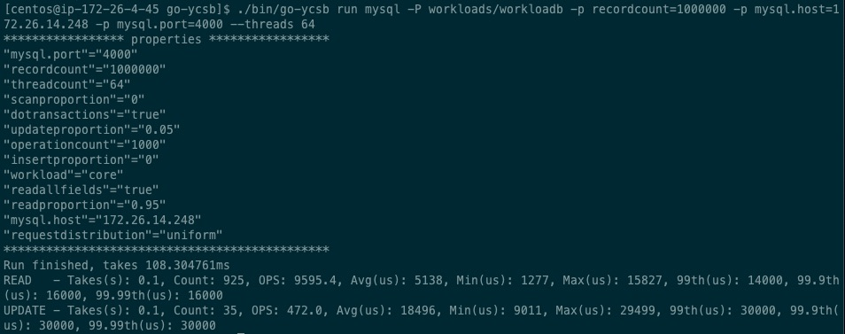

小数据集统计数据如下：

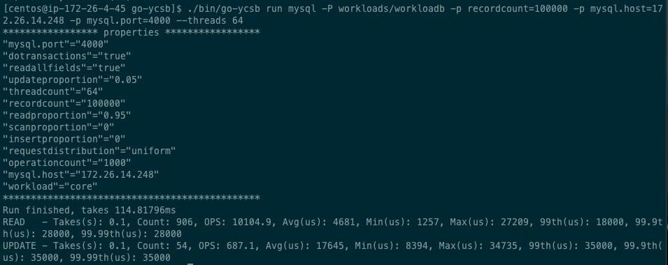

#### workloadc

```sh
# 大数据集
# 载入数据
$ ./bin/go-ycsb load mysql -P workloads/workloadc -p recordcount=1000000 -p mysql.host=172.26.14.248 -p mysql.port=4000 --threads 256
# 运行 workload
$ ./bin/go-ycsb run mysql -P workloads/workloadc -p recordcount=1000000 -p mysql.host=172.26.14.248 -p mysql.port=4000 --threads 64

# 小数据集
$ ./bin/go-ycsb load mysql -P workloads/workloadc -p recordcount=100000 -p mysql.host=172.26.14.248 -p mysql.port=4000 --threads 256
$ ./bin/go-ycsb run mysql -P workloads/workloadc -p recordcount=100000 -p mysql.host=172.26.14.248 -p mysql.port=4000 --threads 64
```

经过试错发现 threads 取 64 在时延和 ops 间能取得较好的均衡。

大数据集统计数据如下：

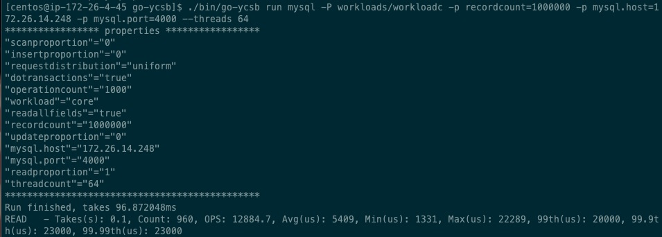

小数据集统计数据如下：

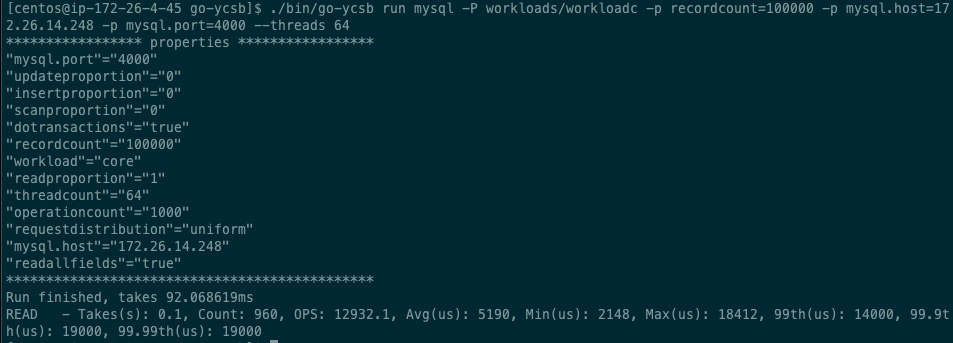

#### workloadd

```sh
# 大数据集
# 载入数据
$ ./bin/go-ycsb load mysql -P workloads/workloadd -p recordcount=1000000 -p mysql.host=172.26.14.248 -p mysql.port=4000 --threads 256
# 运行 workload
$ ./bin/go-ycsb run mysql -P workloads/workloadd -p recordcount=1000000 -p mysql.host=172.26.14.248 -p mysql.port=4000 --threads 64

# 小数据集
$ ./bin/go-ycsb load mysql -P workloads/workloadd -p recordcount=100000 -p mysql.host=172.26.14.248 -p mysql.port=4000 --threads 256
$ ./bin/go-ycsb run mysql -P workloads/workloadd -p recordcount=100000 -p mysql.host=172.26.14.248 -p mysql.port=4000 --threads 64
```

大数据集统计数据如下：

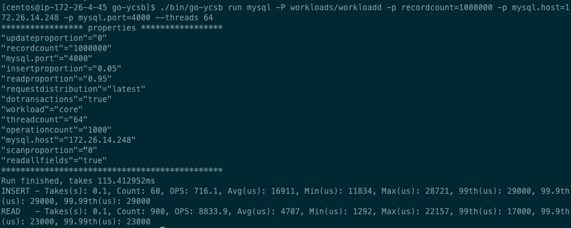

小数据集统计数据如下：

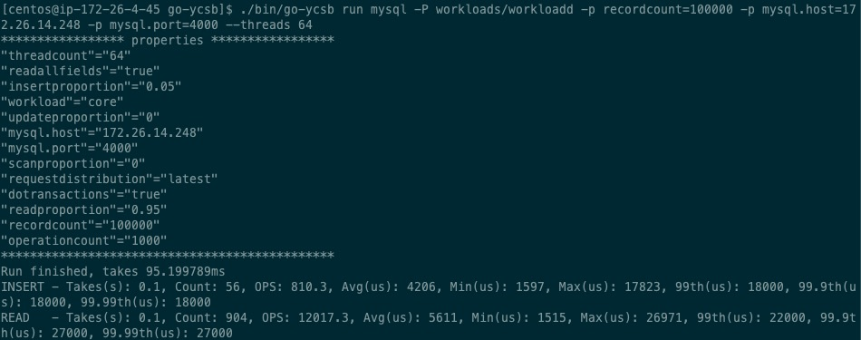

#### workloade

```sh
# 大数据集
# 载入数据
$ ./bin/go-ycsb load mysql -P workloads/workloade -p recordcount=1000000 -p mysql.host=172.26.14.248 -p mysql.port=4000 --threads 256
# 运行 workload
$ ./bin/go-ycsb run mysql -P workloads/workloade -p recordcount=1000000 -p mysql.host=172.26.14.248 -p mysql.port=4000 --threads 64

# 小数据集
$ ./bin/go-ycsb load mysql -P workloads/workloade -p recordcount=100000 -p mysql.host=172.26.14.248 -p mysql.port=4000 --threads 256
$ ./bin/go-ycsb run mysql -P workloads/workloade -p recordcount=100000 -p mysql.host=172.26.14.248 -p mysql.port=4000 --threads 64
```

大数据集统计数据如下：

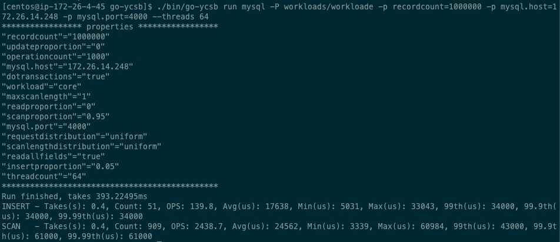

小数据集统计数据如下：

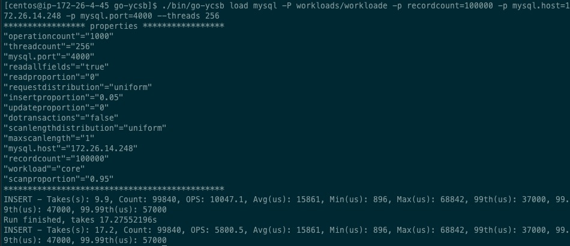

#### workloadf

```sh
# 大数据集
# 载入数据
$ ./bin/go-ycsb load mysql -P workloads/workloadf -p recordcount=1000000 -p mysql.host=172.26.14.248 -p mysql.port=4000 --threads 256
# 运行 workload
$ ./bin/go-ycsb run mysql -P workloads/workloadf -p recordcount=1000000 -p mysql.host=172.26.14.248 -p mysql.port=4000 --threads 64

# 小数据集
$ ./bin/go-ycsb load mysql -P workloads/workloadf -p recordcount=100000 -p mysql.host=172.26.14.248 -p mysql.port=4000 --threads 256
$ ./bin/go-ycsb run mysql -P workloads/workloadf -p recordcount=100000 -p mysql.host=172.26.14.248 -p mysql.port=4000 --threads 64
```

大数据集统计数据如下：

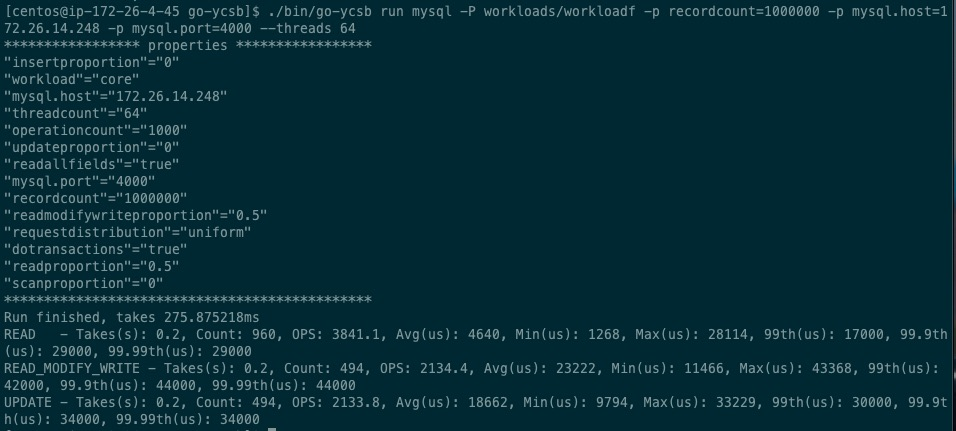

小数据集统计数据如下：

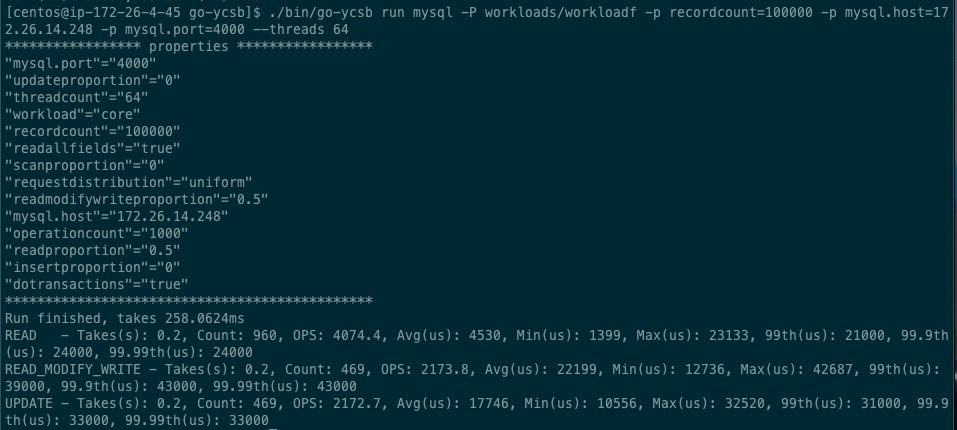

### go-tpc

#### TPC-C

由于 warehouses = 1000 需要等待太长时间，决定取 100：

```sh
# 准备数据
$ ./bin/go-tpc tpcc prepare -H 172.26.14.248 -P 4000 -D tpcc --warehouses 100
# 运行测试
$ ./bin/go-tpc tpcc run -H 172.26.14.248 -P 4000 -D tpcc --warehouses 100
```

运行结果如下：

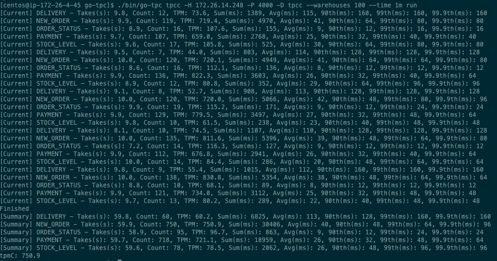

#### TPC-H

先后尝试了 sf 取值 40， 10， 4，发现执行 Q5 的内存都不够，因此只能取 1：

```sh
# 准备数据
$ ./bin/go-tpc tpch run -H 172.26.14.248 -P 4000 -D tpch --sf 1 --db tpch
# 运行测试
$ ./bin/go-tpc tpch prepare -H 172.26.14.248 -P 4000 -D tpch --sf 1 --db tpch
```

运行结果如下：

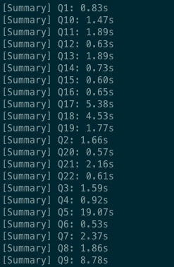

### 关键指标的监控截图

因为昨晚实验后就把实例销毁了，才发现还有这一步，就不再费周章重新部署了。😑，放几个之前截的不属于题目要求的图，证明我看过：

##### TiKV CPU

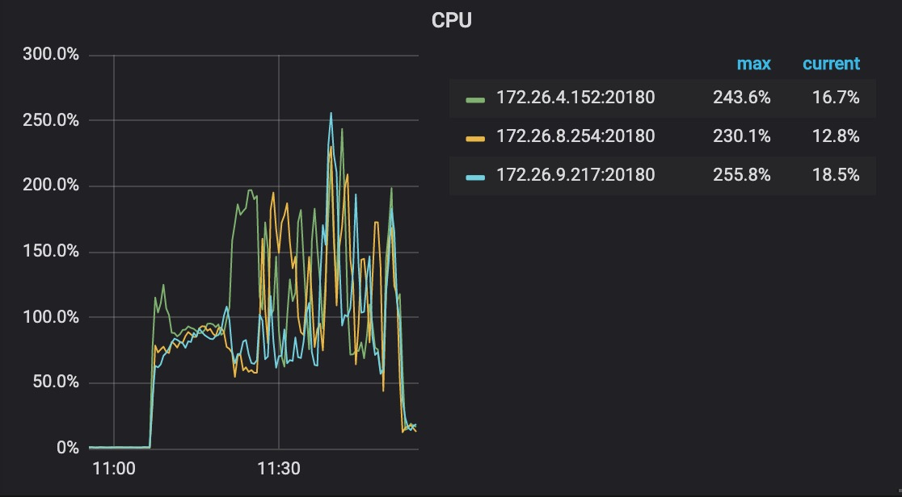

##### TiDB Duration


### 性能瓶颈分析

在测试过程中，我对以下场景做了 profile 抓取：

* [sysbench_prepare_data](./2sysbench_prepare_data)
* [sysbench_prepare_index](./2/sysbench_prepare_index.svg)
* [sysbench-oltp-point-select-small](./2/sysbench-oltp-point-select-small.svg)
* [sysbench-oltp-point-select](./2/sysbench-oltp-point-select.svg)
* [sysbench-oltp-read-only](./2/sysbench-oltp-read-only.svg)
* [sysbench-oltp-update-index-small](./2/sysbench-oltp-update-index-small.svg)
* [sysbench-oltp-update-index](./2/sysbench-oltp-update-index.svg)
* [tpcc-100](./2/tpcc-100.svg)
* [tpch-sf-10-q5](./2/tpch-sf-10-q5.svg)

其中发现耗时较长的模块包括：

* TiDB
  * parser (yyParse)
  * table (CastValue)
  * talbes (*TableCommon.AddRecord)
  * ddl (*addIndexWorker.backfillIndexInTxn)
  * tikv (.tikvSnapshot.Get)
  * session (*session.ExecutePrepareStmt)
  * planner (Optimize)
  * executor (*ExecStmt.handlePessimisticDML)
  * checksum (*Reader.ReadAt)
* runtime
  * mallocgc
  * scanobject
* syscall (io)

