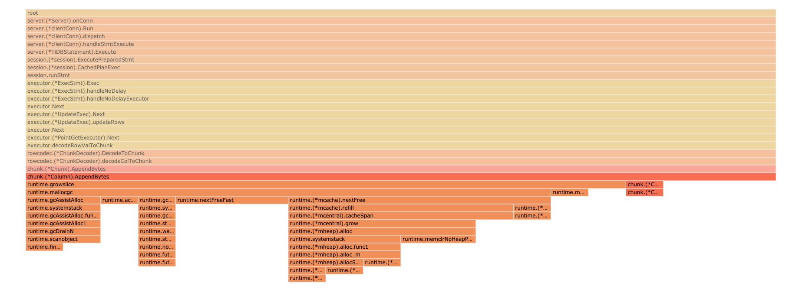
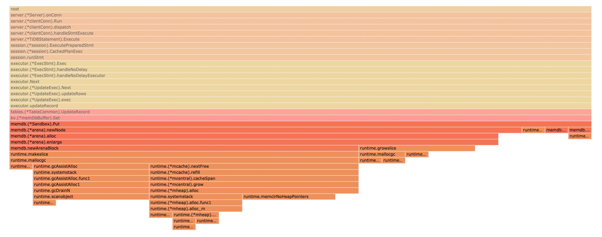
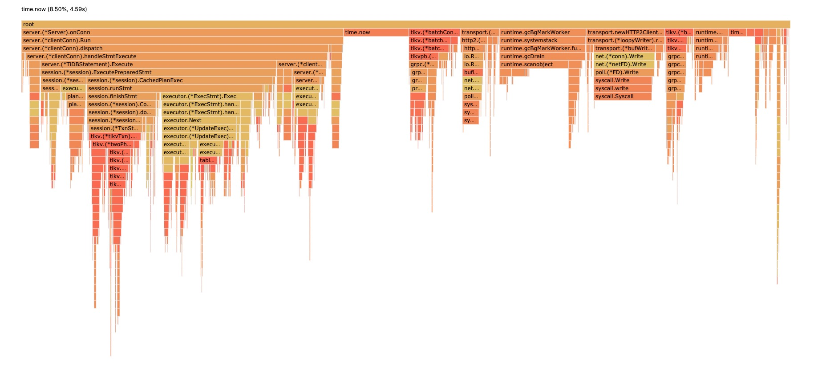

# 第 3 周

## 过程

先重新部署一套 TiDB 集群，机器配置与拓扑结构如下所示：

| 节点名称 | 部署服务                    | CPU     | 内存 | 磁盘规格型号 |
| -------- | --------------------------- | ------- | ---- | ------------ |
| pd       | TiDB/PD                     | 4 vCPUs | 16G  | 320GB SSD    |
| kv1      | TiKV                        | 8 vCPUs | 32G  | 640GB SSD    |
| kv2      | TiKV                        | 8 vCPUs | 32G  | 640GB SSD    |
| kv3      | TiKV                        | 8 vCPUs | 32G  | 640GB SSD    |
| tclient  | 无服务 (用于作为测试客户端) | 4 vCPUs | 16G  | 320GB SSD    |

然后利用 tiup 启动 tidb-test 集群。

在 `tclient` 节点上陆续安装 gvm、go1.13、go-ycsb、unzip 以及 mysql 5.7，用于后续测试使用。全部完成后，选择 ycsb 的 workloada：

```sh
# 载入数据
$ ./bin/go-ycsb load mysql -P workloads/workloada -p recordcount=1000000 -p mysql.host=172.26.15.49 -p mysql.port=4000 --threads 256
# 运行测试
$ ./bin/go-ycsb run mysql -P workloads/workloada -p recordcount=1000000 -p mysql.host=172.26.15.49 -p mysql.port=4000 --threads 64
```

发现测试 200ms 就跑完了。由于 cpu profile 一般要求 30s 以上的采样时间，稍微了解了一下 YCSB 的配置，调整 workloada 的配置，将 operationcount 从原先的 1000 修改成为 300000，再次运行：

```sh
***************** properties *****************
"workload"="core"
"scanproportion"="0"
"mysql.port"="4000"
"updateproportion"="0.5"
"readallfields"="true"
"threadcount"="64"
"requestdistribution"="uniform"
"mysql.host"="172.26.15.49"
"dotransactions"="true"
"readproportion"="0.5"
"insertproportion"="0"
"recordcount"="1000"
"operationcount"="300000"
**********************************************
...
READ   - Takes(s): 53.7, Count: 150235, OPS: 2795.6, Avg(us): 2275, Min(us): 1152, Max(us): 30173, 99th(us): 11000, 99.9th(us): 15000, 99.99th(us): 21000
UPDATE - Takes(s): 53.7, Count: 149733, OPS: 2786.9, Avg(us): 20004, Min(us): 6387, Max(us): 451082, 99th(us): 184000, 99.9th(us): 232000, 99.99th(us): 256000
```

大约需要 54s，满足要求。于是在启动测试的同事，开始对 TiDB 进行 profile 采样：

```sh
$ curl 172.26.15.49:10080/debug/zip?seconds=30 --output debug.zip
$ unzip debug.zip -d debug
Archive:  debug.zip
  inflating: debug/goroutine
  inflating: debug/heap
  inflating: debug/mutex
  inflating: debug/profile
  inflating: debug/config
  inflating: debug/version
```

使用 pprof 启动 web 服务：

```sh
$ go tool pprof -http 0.0.0.0:8080 debug/profile
Serving web UI on http://0.0.0.0:8080
http://0.0.0.0:8080
```

打开相应的网页，就可以开始分析 cpu profile。

## Workload 分析

因为对 TiDB 各组件都不是很了解，有意识地选择了最简单的 workloada，由 50% 查询和 50% 更新构成，通过 TiDB Dashboard 可以看到耗时最多的语句是一些数据更新语句。以下是对 cpu profile 粗略分析后提出的 issue，因为背景知识缺乏，就不随便提到项目上去，仅作为作业提交。

## Issue 1

* 机器配置与拓扑结构 (上文已提及，略)
* workload (上文已提及，略)
* profile 看到的情况



在 chunk.(*Column).AppendBytes 中，几乎所有 cpu 时间都用在了 runtime.growslice 上，说明这里 slice 的初始大小和它的实际使用中的大小并不完全一致。追了一下代码，发现在 newVarLenColumn 中其实已经做了相应的优化：

```go
// tidb/util/chunk/chunk.go

// newVarLenColumn creates a variable length Column with initial data capacity.
func newVarLenColumn(cap int, old *Column) *Column {
	estimatedElemLen := 8
	// For varLenColumn (e.g. varchar), the accurate length of an element is unknown.
	// Therefore, in the first executor.Next we use an experience value -- 8 (so it may make runtime.growslice)
	// but in the following Next call we estimate the length as AVG x 1.125 elemLen of the previous call.
	if old != nil && old.length != 0 {
		estimatedElemLen = (len(old.data) + len(old.data)/8) / old.length
	}
	return &Column{
		offsets:    make([]int64, 1, cap+1),
		data:       make([]byte, 0, cap*estimatedElemLen),
		nullBitmap: make([]byte, 0, (cap+7)>>3),
	}
}
```

* 优化方案：没有明确的优化方案。源码中采用了经验值 (8) 作为初始大小，并且以 1.125 的倍数增长，应该是经过仔细验证、测试过的结果，只能说也许在 workloada 下表现得不够好，仍然需要多次扩容。

### Issue 2

* 机器配置与拓扑结构 (上文已提及，略)
* workload (上文已提及，略)
* profile 看到的情况



在 memdb.(*arena).enlarge 中，大部分 cpu 时间花费在了 makeslice 上，说明这里不断地在建立新的 slice，简单追一下代码，定位到：

```go
// tidb/kv/memdb_arena.go

func (a *memdbArena) enlarge(allocSize, blockSize int) {
	a.blockSize = blockSize
	for a.blockSize <= allocSize {
		a.blockSize <<= 1
	}
	// Size will never larger than maxBlockSize.
	if a.blockSize > maxBlockSize {
		a.blockSize = maxBlockSize
	}
	a.blocks = append(a.blocks, memdbArenaBlock{
		buf: make([]byte, a.blockSize),
	})
}
```

这里每次都会申请新的 []byte。

* 优化方案：也许可以使用资源池来统一管理、复用和回收。

### Issue 3

* 机器配置与拓扑结构 (上文已提及，略)
* workload (上文已提及，略)
* profile 看到的情况



严格来说，这个 issue 只是我个人在看到火焰图时有一点疑惑，在压力测试中，`time.Now` 函数占用的总时间达到了 8.5%，即我们 TiDB 的计算资源有 8.5% 花在了获取当前时间上。

* 优化方案：也许可以删减不必要的 time.Now 调用，或者在不需要精确时间戳的场景下获取时间戳缓存。

## 参考

* [YCSB-wiki-core-properties](https://github.com/brianfrankcooper/YCSB/wiki/Core-Properties)